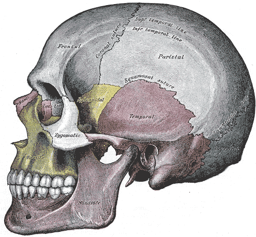
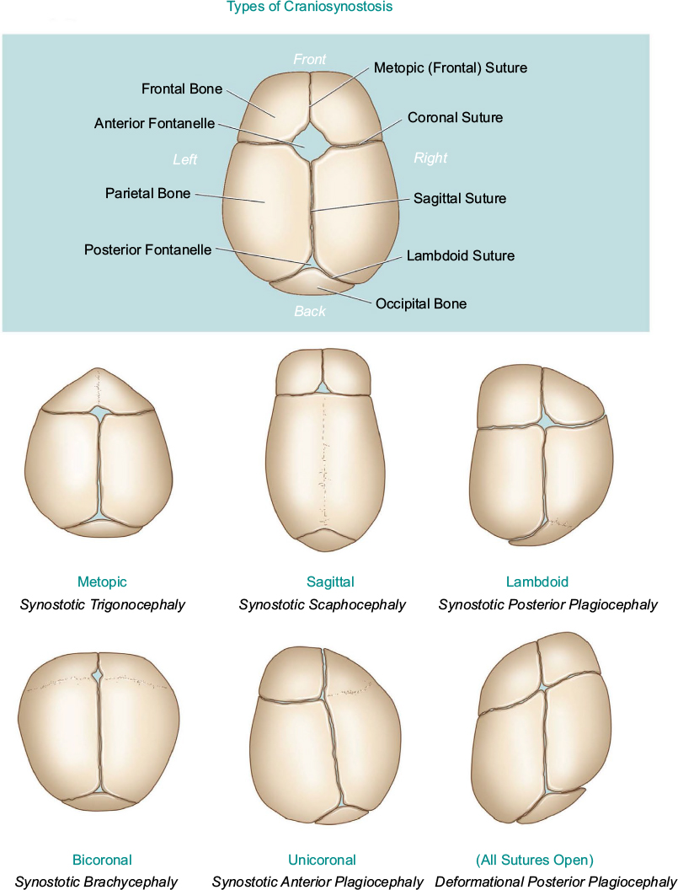
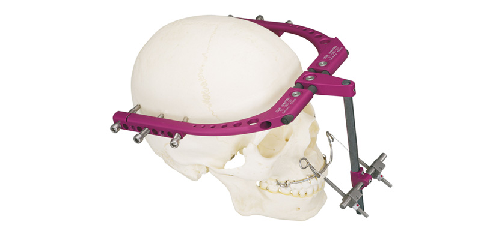
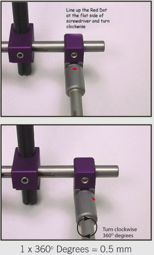
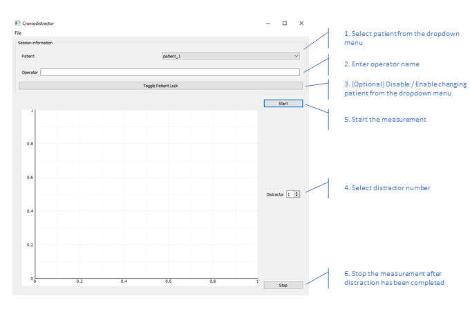
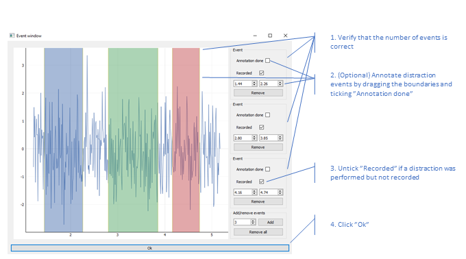
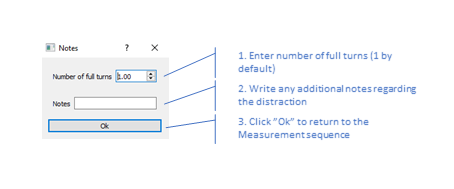

[](https://travis-ci.org/smomni/cranio)
[](https://codecov.io/gh/smomni/cranio)
[](https://cranio.readthedocs.io/en/latest/?badge=latest)
[](https://codeclimate.com/github/smomni/cranio/maintainability)

# cranio

Cranio is a Python package used for force measurements, data analysis and visualization in
posterior calvarial vault osteodistraction (PCVO). PCVO is used to treat patients with craniosynostosis.

Craniosynostosis is a condition occurring in infants where bones in the skull are prematurely fused resulting in
abnormal head shape, decreased intracranial volume (ICV) and increased intracranial pressure (ICP). Fibrous sutures
bones of the skull are prematurely fused by turning into bone. This prevents the skull from growing perpendicular to the
ossified suture which is compensated by increased growth parallel to the fused suture. The features of craniosynostosis
are determined by which sutures are closed. In some case, the resulting growth pattern only leads to abnormal head shape
while leaving enough room for the brain inside the skull. In other cases, in addition to abnormal head shape, intracranial volume is decreased leading to elevated intracranial pressure.
Elevated ICP can cause headache, vomiting, visual impairment (e.g., papilledema), obstructive sleep apnea and
neurobehavioral impairment. Cranisynostosis affects 1/2000 infants and usually occurs as an isolated condition.
In 15% - 40% of cases craniosynostosis is part of a syndrome. Craniosynostosis can be treated with calvarial vault
reconstruction/remodeling (CVR) or posterior calvarial vault osteodistraction (PCVO).





General description on PCVO goes here...

General description on force measurements goes here...


## Getting Started

These instructions will get you a copy of the project up and running on your local machine.

### Hardware

#### External fixator

[KLS Martix Rigid External Fixator (RED)](http://www.klsmartinnorthamerica.com/products/distraction-devices/lefort-i-and-ii/red-ii/) is used as the external fixator.






#### Torque sensor

The craniodistractor measurements are taken with a [Imada HTG2-4](https://imada.com/products/htg2-digital-torque-gauge/) 
digital torque gauge. The gauge features a remote torque sensor with a Jacob's chuck.


### Prerequisites

* OS: Windows, Linux, OS X (tested on Windows 10 and Linux)
* [Python 3.6.x](https://www.python.org/downloads/)
* [git](https://git-scm.com/downloads)

### Installing

The source code is available on [GitHub](https://github.com/smomni/cranio). Install from source using `git` and `pip`:

```bash
git clone https://github.com/smomni/cranio
cd cranio
pip install -e .[test]
```

### Running the tests

Run the test suite using `pytest`:
```bash
pytest
```

### Building the documentation

To build the documentation in HTML format using [Sphinx](http://www.sphinx-doc.org/en/stable/):

```bash
cd docs
make html
```

The built documentation is located in `docs/build/html`.

### Using the software for distraction measurements

To start the measurement software:

```bash
python run.py
```

The distraction workflow consists of three subsequent sequences: 

1. Measurement sequence, 
2. Event detection sequence, and 
3. Note sequence.

#### Measurement sequence

1. Select a patient from the dropdown menu
    * If no patients are listed in the dropdown menu, you need to add one from the File menu in the top left corner
2. Enter operator name
3. (Optional) Disable / Enable changing patient from the dropdown menu by clicking `Toggle Patient Lock`
4. Select distractor number
5. Click `Start` to start the measurement
6. Rotate the distractor slowly and steadily approximately 1/3 of a full turn and monitors the amount of performed rotation from the holes located in the Jacobs Chuck of the screw driver
    * 1/3 of a full turn = distraction event
7. Supports the screw driver with your free hand while repositioning the “rotating hand”
8. Repeat steps 6 and 7 until 1 full turn has been performed
9. Release the screw driver from the distractor
10. Click `Stop` to stop the measurement and start the Event detection sequence





#### Event detection sequence

1. Verify that the number of distraction events (3 by default) is correct
    * If not, remove redundant events by clicking `Remove` for an event or remove all events by clicking `Remove all`
    * Add missing events by setting the number of events to be added in `Add/remove events` and click `Add`
2. (Optional) Annotate distraction events by setting their boundaries to correct positions (i.e., beginning and end of distraction events) and 
ticking `Annotation done` for the distraction events and 
    * Boundaries can be set 
        1) interactively by dragging the boundaries on the figure, or 
        2) entering the boundary time values in the `Event` box
3. If distractions were performed but not measured (e.g., due to operator error), untick `Recorded` for the unrecorded distraction events
    * Example: Operator does the distraction and afterwards realizes that he/she forgot to record it. 
    The operator clicks `Start` and `Stop` to get to the event detection sequence and unticks `Recorded` for the distraction events. 
    This way the fact that the distractions were performed is stored in the database even though no data was recorded.
4. Click `Ok` to continue to the Note sequence

*NOTE: If the operator does not have enough time to do the annotations during the distraction session, 
he/she can skip step 2. The distraction events can later be annotated as a post-processing step.*





#### Note sequence

1. Enter number of full turns (1 by default)
2. Write any additional notes you may have regarding the distraction
3. Click `Ok` to return to the Measurement sequence



    

### Data

The distraction meta and raw data are stored locally in a [SQLite](https://www.sqlite.org/index.html) database file `cranio.db`. 
The database file shall be sent to the investigators for data analysis periodically (e.g., daily or weekly) during the treatment.
The database file contains no sensitive patient information as the patient data is pseudonymized.


## Acknowledgments

* Ritvanen, A., et al. "Force measurements during posterior calvarial vault osteodistraction: A novel measurement method." Journal of Cranio-Maxillofacial Surgery 45.6 (2017): 981-989.

