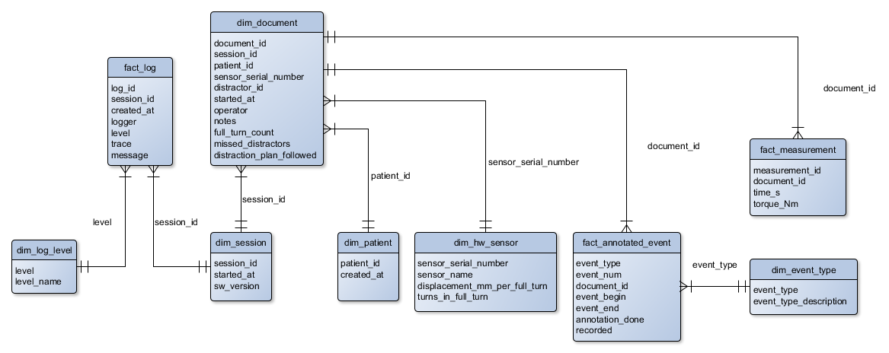

Data model
==========

A relational data model is employed. An entity-relationship (ER) diagram is shown in Figure 1.
The data is stored locally in a SQLite database (file ``cranio.db``).

    Figure 1. Entity-relationship diagram

Tables
------

The database tables are described in this section.

dim_session
^^^^^^^^^^^

Every time the application is launched an entry to the ``dim_session`` table is generated.
The launch date and time is stored in column ``started_at``.
Application version string is stored in column ``sw_version``.

dim_patient
^^^^^^^^^^^

Pseudonymized patient information. The patients are entered to the database from the application.
The person entering the ``patient_id`` is responsible for pseudonymization.
The creation date and time is stored in column ``created_at``.

dim_document
^^^^^^^^^^^^

Every time the Start button is clicked an entry to the ``dim_document`` table is generated.
The following columns are also entered at this time:

* ``session_id``: Active session
* ``patient_id``: Active patient (operator selects from main window)
* ``sensor_serial_number``: Active sensor (operator selects from main window)
* ``distractor_id``: Active distractor (operator selects from main window)
* ``started_at``: Measurement start date and time
* ``operator``: Active operator (operator enters in the main window)

The following columns are updated once the event detection has finished:

* ``notes``: Measurement notes (operator enters in the notes window)
* ``full_turn_count``: Number of performed full turns (operator enters in the notes window)
* ``missed_distractors``: **TODO: Is this really needed?**
* ``distraction_plan_followed``: True/False indicating if the distraction plan was followed (operator enters in the notes window)

dim_hw_sensor
^^^^^^^^^^^^^

Sensor hardware information. The ``sensor_serial_number`` is automatically detected from the connected sensor.
Column ``turns_in_full_turn`` is the sensor-specific number of turns in one full turn.

dim_hw_distractor
^^^^^^^^^^^^^^^^^

Distractor hardware information.
Column ``displacement_mm_per_full_turn`` describes the amount of displacement generated from one full distractor turn
and is determined during hardware calibration.

fact_annotated_event
^^^^^^^^^^^^^^^^^^^^

Annotated event information. The user selects regions from the measured time-torque data during event detection.
Column descriptions:

* ``event_type``: Event type identifier (e.g., ``D`` for distraction)
* ``event_num``: Event enumerator determined from the temporal location of the event with respect to other events in the document
* ``document_id``: Document to which the measurements belong to
* ``event_begin``: Left region boundary
* ``event_end``: Right region boundary
* ``annotation_done``: True/False indicating if the annotation has been done (operator enters during event detection). If False, the operator shall perform the annotation at a later time.
* ``recorded``: True/False indicating if the data was recorded for the event (operator enters during event detection)

dim_event_type
^^^^^^^^^^^^^^

Event type lookup table. Populated with the following values during database initialization:

* ``{event_type: "D", event_type_description: "Distraction event"}``

fact_measurement
^^^^^^^^^^^^^^^^

Measured ``torque_Nm`` (Nm) and ``time_s`` (s) values.
Column defines ``document_id`` the document during which the data was recorded.

fact_log
^^^^^^^^

Software log information. Columns:

* ``log_id``: autoincrement integer
* ``session_id``: session during which the log entry was generated
* ``created_at``: log entry date and time
* ``logger``: logger name
* ``level``: logging level
* ``trace``: error traceback
* ``message``: log message

dim_log_level
^^^^^^^^^^^^^

Log level lookup table. Populated with the following values during database initialization:

* ``{level: 50, level_name: "CRITICAL"}``
* ``{level: 40, level_name: "ERROR"}``
* ``{level: 30, level_name: "WARNING"}``
* ``{level: 20, level_name: "INFO"}``
* ``{level: 10, level_name: "DEBUG"}``
* ``{level: 0, level_name: "NOTSET"}``

Example SQL queries
-------------------

.. todo: Include queries as .sql files

Calculate average torque for all events::

    SELECT patient_id, b.document_id, b.started_at, distractor_id, event_num, event_type, AVG(a.torque_Nm) as `avg. torque` FROM fact_measurement as a
    INNER JOIN dim_document as b, fact_annotated_event as c USING (document_id)
    INNER JOIN dim_event_type as d USING (event_type)
    WHERE a.time_s > c.event_begin AND a.time_s < c.event_end
    GROUP BY c.event_num;

