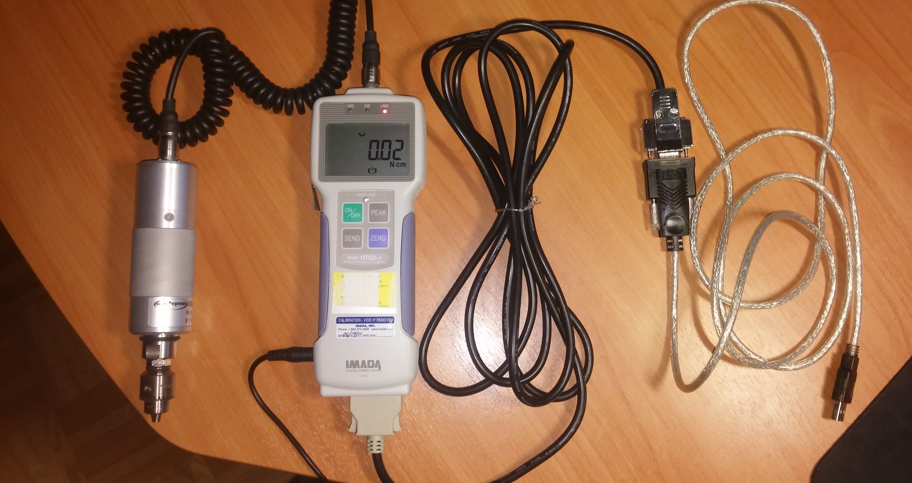

.. cranio documentation master file, created by
   sphinx-quickstart on Fri Jul  6 20:28:42 2018.
   You can adapt this file completely to your liking, but it should at least
   contain the root `toctree` directive.

cranio documentation
====================

About cranio
------------

Cranio is a Python library used for force measurements, data analysis and visualization in
posterior calvarial vault osteodistraction (PCVO).

General description on PCVO goes here...

General description on force measurements goes here...

Prequisites
-----------

Machine with one of the following operating systems

* Windows (tested with Windows 10)
* Linux (tested with Debian_)
* OS X (not tested)

In addition, you need the following software packages:

* Python_ 3.6 or newer

The craniodistractor measurements are taken with an `Imada HTG2-4`_ digital torque gauge. The gauge features a remote torque sensor with a Jacob's chuck.

   Imada HTG2-4 digital torque gauge with Jacob's chuck (left) and USB serial interface (right).

.. _Debian: https://www.debian.org/
.. _Python: https://www.python.org/downloads/
.. _Imada HTG2-4: https://imada.com/products/htg2-digital-torque-gauge/

Installation
------------

The source code is currently hosted on GitHub at https://github.com/smomni/cranio.

You can use git clone and pip to install from sources:

::

   git clone https://github.com/smomni/cranio
   cd cranio
   pip install -e .[test]

Using cranio
------------

To start the measurement software:

::

   cd <cranio-installation-directory>
   python run.py

Use cases
---------

.. toctree::
   :maxdepth: 2

   use_cases.rst

Concepts
--------

.. toctree::
   :maxdepth: 2

   state_machine.rst
   data_model.rst

API
---

.. toctree::
   :maxdepth: 2

   api.rst

Indices and tables
------------------

* :ref:`genindex`
* :ref:`modindex`
* :ref:`search`