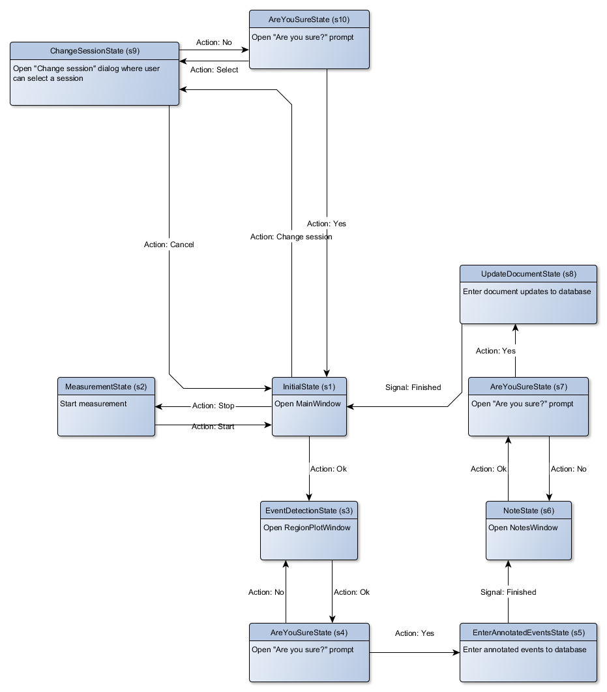

State machine
=============

The craniodistraction workflow is implemented as a finite-state machine where the system can be in exactly one of a
finite number of a states at any given time. Transitions between states are triggered by various events, such as user
clicking a button or pressing a keyboard shortcut. Transitions may contain checks to verify that all the pre-requisites
for the next state are met. The craniodistraction states and transitions are illustrated in Figure 1.

    Figure 1. State diagram

A typical measurement state flow goes as follows (software state in brackets):

1. [``InitialState``] Start the software
2. [``InitialState``] Connect torque sensor from the Connect menu
3. [``InitialState``] Click Start
4. [``MeasurementState``] Click Stop when the measurements are complete
5. [``EventDetectionState``] Annotate events and click Ok
6. [``NoteState``] Enter number of full turns and notes and click Ok
7. [``AreYouSureState``] Click Yes
8. [``InitialState``] Click Start to begin next measurement

Keyboard shortcuts
------------------

To streamline the measurement workflow, the following keyboard shortcuts are enabled:

* ``InitialState``
    * Enter = Click Start
    * Up / Down arrow = Click distractor Up / Down arrow
* ``MeasurementState``
    * Enter = Click Stop
* ``EventDetectionState``
    * Enter = Click Add if no events have been annotated yet. Otherwise, Click Ok.
    * Up / Down arrow = Click Up / Down arrow in Add/remove events groupbox
* ``NoteState``
    * Enter = Click Ok
* ``AreYouSureState``
    * Enter = Click Yes
